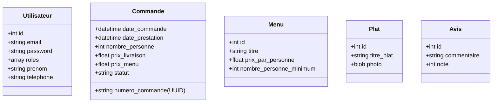

# 🍽️ Vite-et-Gourmand

Un projet Symfony 7.4 pour la gestion des commande de menus, avec l'appui d'une stack Docker optimisée.

---

## 🚀 Stack Technique

- **Framework** : Symfony 7.4 LTS (PHP 8.4)
- **Serveur Web** : Nginx (Alpine)
- **Base de données relationnelle** : PostgreSQL 18 (Doctrine ORM)
- **Base de données NoSQL** : MongoDB 7 (Doctrine ODM)
- **Outils** : Mailpit (Capture d'emails), Mongo Express (Admin MongoDB), Composer 2.8

---

## 🏗️ Architecture & Modèle de Données

Le projet suit une architecture MVC classique avec Symfony, en mettant l'accent sur un domaine métier robuste.

### Double base de données

Le projet utilise **deux systèmes de bases de données** complémentaires :
- **PostgreSQL** (Doctrine ORM) : Données relationnelles (Utilisateurs, Commandes, Menus, Plats, Avis, etc.) dans `src/Entity/`
- **MongoDB** (Doctrine ODM) : Données documentaires (Horaires) dans `src/Document/`

### Schéma des Entités (Aperçu)



---

## 💡 Philosophie de Développement

### 🛡️ Validation
Nous utilisons la validation standard de Symfony pour garantir l'intégrité des données :
- **Validation Doctrine/Symfony** : Utilisation des attributs `#[Assert]` pour la validation automatique (ex: email, longueurs, types).

### Commande 🆔 Identifiants Uniques
- Utilisation de **UUID v4** + Date Reference : 
  Pour les numéros de commande (`Commande::numero_commande`), offrant une sécurité accrue et une meilleure portabilité des données.
  
### 🔑 Gestion des mots de passe
- Utilisation du standard Symfony `UserPasswordHasherInterface` avec l'algorithme par défaut (auto) pour une sécurité optimale.
- Stockage en base de données sur 255 caractères (`VARCHAR(255)`). Contrairement a montrer dans le Schema annexe de la base de données.

### 📧 Configuration de l'envoi d'emails (Symfony Mailer)

**Choix technique : Mode synchrone (`sync`) pour l'envoi d'emails**

Par défaut, Symfony 7 utilise **Messenger** pour envoyer les emails en mode **asynchrone** via une file d'attente. Cela nécessite de lancer un worker en continu pour consommer les messages :
```bash
php bin/console messenger:consume async
```

#### Pourquoi le mode synchrone ?

Pour ce projet, nous avons configuré `Symfony\Component\Mailer\Messenger\SendEmailMessage: sync` dans `config/packages/messenger.yaml`.

**Avantages pour notre contexte :**
- ✅ **Simplicité opérationnelle** : Pas besoin de gérer un worker Messenger en production
- ✅ **Volume faible** : Application à petit/moyen trafic (formulaire de contact & commande a priori...)
- ✅ **Feedback immédiat** : L'utilisateur peut le vérifier immédiatement
- ✅ **Déploiement** : Configuration identique en dev et prod

**Mode asynchrone SI :**
Volume d'emails ++ (> 100/jour)
si les temps de réponse deviennent trop longs
Et alors :
1. Repasser en mode `async`
2. Déployer un worker Messenger
3. Transport plus robuste que Doctrine

**Configuration :**
- **Transport SMTP** : Configuré via `MAILER_DSN` dans `.env.local`
- **Mode développement** : MailHog sur `smtp://localhost:1025`
- **Mode production** : SMTP réel (Gmail, SendGrid, Brevo, etc.)

### 🛒 Système de Commande

#### Parcours utilisateur

1. **Utilisateur connecté** : Clic sur "Commander" (d'un container Menu) → Formulaire pré-rempli → Récapitulatif
2. **Utilisateur non connecté** : Clic sur "Commander" (d'un container Menu) → Modale d'invitation à se connecter/s'inscrire → Redirection automatique vers la commande après login
3. **Accès direct** (`/commande/new`) : Clic sur Commander (generique : menu inconnu) → Listing des menus intégré pour sélection → Formulaire

#### Réduction tarifaire

> 10% est automatiquement appliquée sur le prix total du menu lorsque le nombre de personnes commandé dépasse de 5 ou plus le minimum requis par le menu.
>
> `prixMenu = prixParPersonne × nombrePersonne × 0.90` (si `nombrePersonne >= min + 5`)

#### Gestion du stock
- Le bouton "Commander" est remplacé par **"Épuisé"** si `quantiteRestante <= 0`
- Une **vérification serveur** est effectuée au moment de la soumission (protection contre les commandes concurrentes) + stock est **décrémenté automatiquement** à chaque commande validée

> Le changement de statut est réservé aux rôles `ROLE_SALARIE` et `ROLE_ADMIN` tout comme le calcul du prix de la livraison a partir de l'adresse renseignée par le client.

---

## 🛠️ Installation & Workflow

## Développement
### Mode rapide (DB Docker + PHP local)
docker compose up -d db
symfony serve --port=8080
### Mode Docker complet
docker compose up -d


### 1. Installation Rapide
```bash
git clone git@github.com:PhilHika/Vite-Gourmand.git
cd Vite-et-Gourmand
cp .env .env.local # Configurez vos variables
docker compose up -d --build
docker compose exec php composer install
```

### 2. Commandes Utiles

| Action | Commande |
| :--- | :--- |
| **PostgreSQL (ORM)** | |
| Créer une migration | `docker compose exec php php bin/console make:migration` |
| Appliquer les migrations | `docker compose exec php php bin/console doctrine:migrations:migrate` |
| **MongoDB (ODM)** | |
| Créer le schéma MongoDB | `docker compose exec php php bin/console doctrine:mongodb:schema:create` |
| **Qualité & Debug** | |
| Vider le cache | `docker compose exec php php bin/console cache:clear` |
| Voir les routes | `docker compose exec php php bin/console debug:router` |
| Accéder au conteneur PHP | `docker compose exec php bash` |
| **Logs** | `docker compose logs -f` |

---

## 🌐 Accès aux Services
- **Application** : [http://localhost:8080](http://localhost:8080)
- **Mongo Express (Admin MongoDB)** : [http://localhost:8081](http://localhost:8081)
- **Mailpit (Emails)** : [http://localhost:8025](http://localhost:8025)

---

## 📝 Licence
Projet réalisé dans le cadre d'un ECF.
