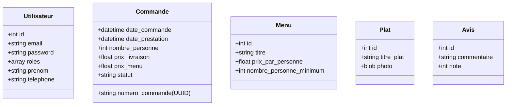

# 🍽️ Vite-et-Gourmand

Un projet Symfony 7.4 pour la gestion des commande de menus, avec l'appui d'une stack Docker optimisée.

---

## 🚀 Stack Technique

- **Framework** : Symfony 7.4 LTS (PHP 8.4)
- **Serveur Web** : Nginx (Alpine)
- **Base de données** : PostgreSQL 18
- **Outils** : Mailpit (Capture d'emails), Composer 2.8

---

## 🏗️ Architecture & Modèle de Données

Le projet suit une architecture MVC classique avec Symfony, en mettant l'accent sur un domaine métier robuste.

### Schéma des Entités (Aperçu)



---

## 💡 Philosophie de Développement

### 🛡️ Validation
Nous utilisons la validation standard de Symfony pour garantir l'intégrité des données :
- **Validation Doctrine/Symfony** : Utilisation des attributs `#[Assert]` pour la validation automatique (ex: email, longueurs, types).

### Commande 🆔 Identifiants Uniques
- Utilisation de **UUID v4** + Date Reference : 
  Pour les numéros de commande (`Commande::numero_commande`), offrant une sécurité accrue et une meilleure portabilité des données.
  
### 🔑 Gestion des mots de passe
- Utilisation du standard Symfony `UserPasswordHasherInterface` avec l'algorithme par défaut (auto) pour une sécurité optimale.
- Stockage en base de données sur 255 caractères (`VARCHAR(255)`). Contrairement a montrer dans le Schema annexe de la base de données.

---

## 🛠️ Installation & Workflow

## Développement
### Mode rapide (DB Docker + PHP local)
docker compose up -d db
symfony serve --port=8080
### Mode Docker complet
docker compose up -d


### 1. Installation Rapide
```bash
git clone git@github.com:PhilHika/Vite-Gourmand.git
cd Vite-et-Gourmand
cp .env .env.local # Configurez vos variables
docker compose up -d --build
docker compose exec php composer install
```

### 2. Commandes Utiles

| Action | Commande |
| :--- | :--- |
| **Bases de données** | |
| Créer une migration | `docker compose exec php php bin/console make:migration` |
| Appliquer les migrations | `docker compose exec php php bin/console doctrine:migrations:migrate` |
| **Qualité & Debug** | |
| Vider le cache | `docker compose exec php php bin/console cache:clear` |
| Voir les routes | `docker compose exec php php bin/console debug:router` |
| Accéder au conteneur PHP | `docker compose exec php bash` |
| **Logs** | `docker compose logs -f` |

---

## 🌐 Accès aux Services
- **Application** : [http://localhost:8080](http://localhost:8080)
- **Mailpit (Emails)** : [http://localhost:8025](http://localhost:8025)

---

## 📝 Licence
Projet réalisé dans le cadre d'un ECF.
