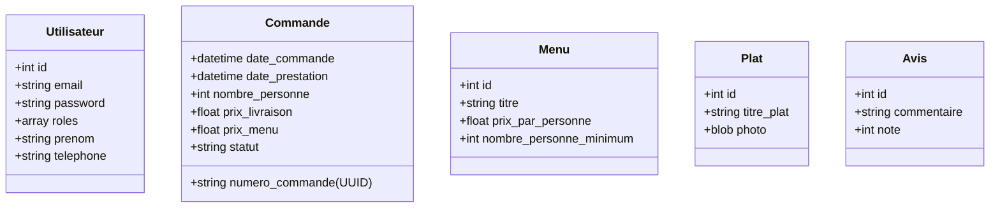

# 🍽️ Vite-et-Gourmand

Un projet Symfony 7.4 pour la gestion des commande de menus, avec l'appui d'une stack Docker optimisée.

---

## 🚀 Stack Technique

- **Framework** : Symfony 7.4 LTS (PHP 8.4)
- **Serveur Web** : Nginx (Alpine)
- **Base de données relationnelle** : PostgreSQL 18 (Doctrine ORM)
- **Base de données NoSQL** : MongoDB 7 (Doctrine ODM)
- **Outils** : Mailpit (Capture d'emails), Mongo Express (Admin MongoDB), Composer 2.8

---

## 🏗️ Architecture & Modèle de Données

Le projet suit une architecture MVC classique avec Symfony, en mettant l'accent sur un domaine métier robuste.

### Double base de données

Le projet utilise **deux systèmes de bases de données** complémentaires :
- **PostgreSQL** (Doctrine ORM) : Données relationnelles (Utilisateurs, Commandes, Menus, Plats, Avis, etc.) dans `src/Entity/`
- **MongoDB** (Doctrine ODM) : Données documentaires (Horaires) dans `src/Document/`

### Schéma des Entités (Aperçu)



---

## 💡 Philosophie de Développement

### 🛡️ Validation
Nous utilisons la validation standard de Symfony pour garantir l'intégrité des données :
- **Validation Doctrine/Symfony** : Utilisation des attributs `#[Assert]` pour la validation automatique (ex: email, longueurs, types).

### Commande 🆔 Identifiants Uniques
- Utilisation de **UUID v4** + Date Reference : 
  Pour les numéros de commande (`Commande::numero_commande`), offrant une sécurité accrue et une meilleure portabilité des données.
  
### 🔑 Gestion des mots de passe
- Utilisation du standard Symfony `UserPasswordHasherInterface` avec l'algorithme par défaut (auto) pour une sécurité optimale.
- Stockage en base de données sur 255 caractères (`VARCHAR(255)`). Contrairement a montrer dans le Schema annexe de la base de données.

### 📧 Système d'emails (Symfony Mailer + Pattern Service)

#### Architecture Service

Les emails sont gérés par des **services dédiés** (Pattern Service / SRP)
src/Service/
├── CommandeMailerService.php          ← Emails liés aux commandes
├── ContactMailerService.php           ← Emails liés au formulaire de contact
└── PasswordResetMailerService.php     ← Emails liés au reset de mot de passe
```

#### Emails automatiques

| Trigger | Destinataire | Service |
| :--- | :--- | :--- |
| Nouvelle commande confirmée | Client + tous gestionnaires `[STAFF]` | `CommandeMailerService` |
| Changement de statut (admin) | Client + tous gestionnaires `[STAFF]` | `CommandeMailerService` |
| Formulaire de contact | Équipe admin | `ContactMailerService` |
| Réinitialisation mot de passe | Utilisateur demandeur | `PasswordResetMailerService` |

Les gestionnaires (ROLE_SALARIE + ROLE_ADMIN) sont récupérés dynamiquement via `UtilisateurRepository::findGestionnaires()`.

#### Mode synchrone

Configuré via `SendEmailMessage: sync` dans `config/packages/messenger.yaml`. 

#### Configuration SMTP
- **Dev** : MailHog sur `smtp://localhost:1025` (interface : http://localhost:8025)
- **Prod** : SMTP réel (Gmail, SendGrid, Brevo, etc.) via `MAILER_DSN` dans `.env.local`

### 🔐 Réinitialisation de mot de passe

Implémentation manuelle (sans bundle externe) avec une **table dédiée** `reset_password_request` :
- Le schéma de la table `utilisateur` n'est **pas modifié**
- Tokens UUID v4, expiration 1 heure
- Message identique que l'email existe ou non (sécurité : pas de divulgation d'emails)
- Après reset : session invalidée, l'utilisateur doit se reconnecter

| Route | Description |
| :--- | :--- |
| `/reset-password` | Formulaire de demande (saisie email) |
| `/reset-password/{token}` | Formulaire de saisie du nouveau mot de passe |

### 🛒 Système de Commande

#### Parcours utilisateur

1. **Utilisateur connecté** : Clic sur "Commander" (d'un container Menu) → Formulaire pré-rempli → Récapitulatif
2. **Utilisateur non connecté** : Clic sur "Commander" (d'un container Menu) → Modale d'invitation à se connecter/s'inscrire → Redirection automatique vers la commande après login
3. **Accès direct** (`/commande/new`) : Clic sur Commander (generique : menu inconnu) → Listing des menus intégré pour sélection → Formulaire

#### Réduction tarifaire

> 10% est automatiquement appliquée sur le prix total du menu lorsque le nombre de personnes commandé dépasse de 5 ou plus le minimum requis par le menu.
>
> `prixMenu = prixParPersonne × nombrePersonne × 0.90` (si `nombrePersonne >= min + 5`)

#### Gestion du stock
- Le bouton "Commander" est remplacé par **"Épuisé"** si `quantiteRestante <= 0`
- Une **vérification serveur** est effectuée au moment de la soumission (protection contre les commandes concurrentes) + stock est **décrémenté automatiquement** à chaque commande validée

#### Gestion admin des commandes (`ROLE_SALARIE` / `ROLE_ADMIN`)

| Route | Description |
| :--- | :--- |
| `/admin/commande/` | Listing de **toutes** les commandes (tous clients) |
| `/admin/commande/{id}/edit` | Formulaire d'édition complet (statut, prix, dates, matériel) |

- **Prix total** affiché avec décomposition : `prixMenu + prixLivraison = Total`
- **Recalcul automatique** du prix menu (bouton dédié, basé sur `prixParPersonne × nbPersonnes ± réduction`)
- **Navigation** : Liens dans le dropdown Compte + bouton sur la page profil

> Le changement de statut est réservé aux rôles `ROLE_SALARIE` et `ROLE_ADMIN` tout comme le calcul du prix de la livraison a partir de l'adresse renseignée par le client.

---

## 🛠️ Installation & Workflow

## Développement
### Mode rapide (DB Docker + PHP local)
docker compose up -d db
symfony serve --port=8080
### Mode Docker complet
docker compose up -d


### 1. Installation Rapide
```bash
git clone git@github.com:PhilHika/Vite-Gourmand.git
cd Vite-et-Gourmand
cp .env .env.local # Configurez vos variables
docker compose up -d --build
docker compose exec php composer install
```

### 2. Commandes Utiles

| Action | Commande |
| :--- | :--- |
| **PostgreSQL (ORM)** | |
| Créer une migration | `docker compose exec php php bin/console make:migration` |
| Appliquer les migrations | `docker compose exec php php bin/console doctrine:migrations:migrate` |
| **MongoDB (ODM)** | |
| Créer le schéma MongoDB | `docker compose exec php php bin/console doctrine:mongodb:schema:create` |
| **Qualité & Debug** | |
| Vider le cache | `docker compose exec php php bin/console cache:clear` |
| Voir les routes | `docker compose exec php php bin/console debug:router` |
| Accéder au conteneur PHP | `docker compose exec php bash` |
| **Logs** | `docker compose logs -f` |

---

## 🌐 Accès aux Services
- **Application** : [http://localhost:8080](http://localhost:8080)
- **Mongo Express (Admin MongoDB)** : [http://localhost:8081](http://localhost:8081)
- **Mailpit (Emails)** : [http://localhost:8025](http://localhost:8025)

---

## 📝 Licence
Projet réalisé dans le cadre d'un ECF.
